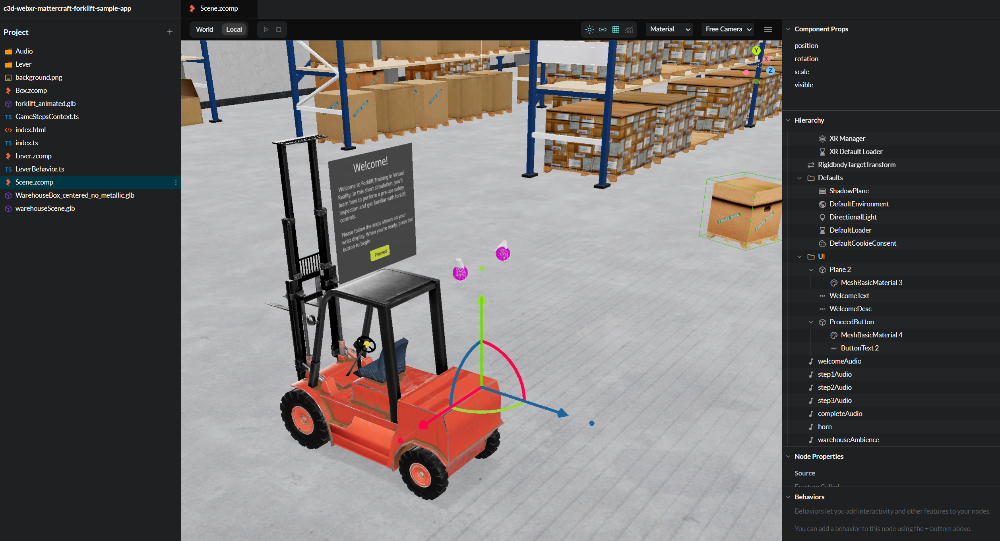

# Mattercraft WebXR Forklift Training Demo

This is an interactive forklift operator training simulation built with [Mattercraft](https://mattercraft.io/) and WebXR. It's integrated with the [`@cognitive3d/three-mattercraft`](https://github.com/CognitiveVR/mattercraft-cognitive3d) npm package, which provides detailed analytics and session replay.

This project serves as a practical example of how to:
* Build a guided, step-based XR training experience in Mattercraft.
* Use a physical lever controller to drive a 3D forklift animation.
* Integrate Cognitive3D analytics to track user behavior and dynamic object movement.
* Export scene assets and dynamic objects directly from a running application for upload to the Cognitive3D platform.

## Requirements
- [Mattercraft](https://mattercraft.io/)
- WebXR-capable device (Meta Quest recommended)
- [Cognitive3D Account](https://get.cognitive3d.com/) with API Keys (Developer and Application Key)

## Quick Start 

Once you have set up an account with Mattercraft, create a new Mattercraft project. When you’re on the template selection screen, select the **Import from ZIP** button (bottom left of the screen), and then select this zipped project. 

## Project Structure

| File / Folder | Description |
|---|---|
| `Scene.zcomp` | Main Mattercraft scene — warehouse environment, forklift, game state animations |
| `Lever.zcomp` | Reusable lever component with physical grab interaction |
| `Box.zcomp` | Warehouse box component used as a dynamic tracked object |
| `index.ts` | Entry point — initializes the Mattercraft scene with WebXR support |
| `LeverBehavior.ts` | Reads lever rotation and seeks the forklift's up/down animation timeline |
| `GameStepsContext.ts` | Manages the training step state machine (Step 1 → 4) |
| `Audio/` | Narration and ambient audio clips for each training step |
| `*.glb` | 3D models: warehouse scene, forklift, and warehouse box |

## How It Works

### Training Flow
The experience is guided through a series of steps driven by Mattercraft's animation state machine (`Game_States` layer):

1. **Step 1 (`Step_10`)** — Welcome narration plays; user is introduced to the warehouse.
2. **Step 2 (`Step_20`)** — User is prompted to interact with the forklift lever.
3. **Step 3 (`Step_30`)** — The user's XR position is offset to place them at the forklift; the fork raising task begins.
4. **Step 4 (`Step40`)** — Completion sequence plays.

A button in the scene advances through steps 1–3 on `onPointerDown`.

### Lever Interaction
The `Lever` behavior (in `Lever/Lever.ts`) detects when the user's hand/controller comes within 0.3 m of the lever handle. Once grabbed, the lever's X-axis rotation follows the hand position. `LeverBehavior.ts` reads this rotation each frame and maps it to a position on the forklift's `ForkliftUpandDown0` animation clip:

- Lever pulled back (−45°) → forks fully lowered
- Lever neutral (0°) → forks at mid-height
- Lever pushed forward (+45°) → forks fully raised

### Cognitive3D Analytics
`Cognitive3D.ts` provides:
- **Session tracking** — starts/ends automatically with the XR session.
- **Gaze recording** — sampled at 10 Hz using the active camera's world transform.
- **Dynamic object tracking** — the forklift and boxes are registered as dynamic objects so their positions are recorded throughout the session.

## Setup

### 1. Open in Mattercraft

Create a new Mattercraft project. When you’re on the template selection screen, select **Import from ZIP**. You will need to zip this Mattercraft project first. 

### 2. Configure Cognitive3D Credentials and Options
In the Mattercraft scene editor, select the node that has the `Cognitive3D` behavior attached and fill in the following properties in the inspector. Note that you may not have access to properties such as `sceneId`, `sceneName`, and `sceneVersion` until you upload scene data to Cognitive3D. 

| Property | Description |
|---|---|
| `apiKey` | Your Cognitive3D application key |
| `sceneId` | The scene ID from the Cognitive3D dashboard |
| `sceneName` | The scene name registered on the Cognitive3D dashboard |
| `sceneVersion` | (Optional) Scene version number — defaults to `"1"` |
| `AppVersion` | (Optional) App version — defaults to `"1.0"` |
| `ExportToggle` | Toggle ON to enable scene and dynamic object export at runtime. Save the project after changing this toggle. |
| `DebugToggle` | Toggle ON for verbose logging in the browser console. Save the project after changing this toggle. |

### 3. Run / Publish
Use the Mattercraft editor's built-in **Run** or **Publish** workflow to preview and deploy the experience to a WebXR device.

## Exporting Assets to Cognitive3D

Before you can view analytics on the Cognitive3D dashboard, you need to upload scene and dynamic object representations. First, ensure the **Export Toggle** is enabled under the Cognitive3D behavior. Save the project after making this change. 

### Export Dynamic Objects — `Shift + D`
While the app is running in a browser, press **Shift + D** to export all registered dynamic objects. Each object is exported as a GLB file and saved/downloaded. These files are uploaded to the Cognitive3D dashboard to enable object-level heatmaps and tracking.

### Export Scene — `Shift + E`
Press **Shift + E** to export the static scene geometry. This exports:
- `scene.gltf` — the 3D scene model
- `scene.bin` — geometry data
- `settings.json` — uploader configuration
- `screenshot.png` — scene thumbnail

### Uploading to the Dashboard
Once you have the exported files, use [Cognitive3D's upload tool website](https://upload.cognitive3d.com/) to upload the scene and objects to Cognitive3D. You will then have access to your `sceneId`, `sceneName`, and `sceneVersion`. Enter these parameters into the Cognitive3D behavior in your Mattercraft Scene.
